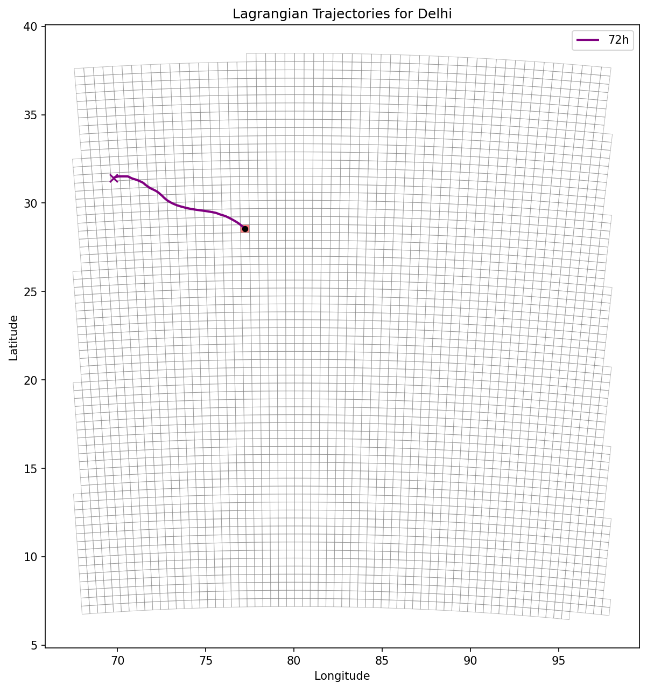
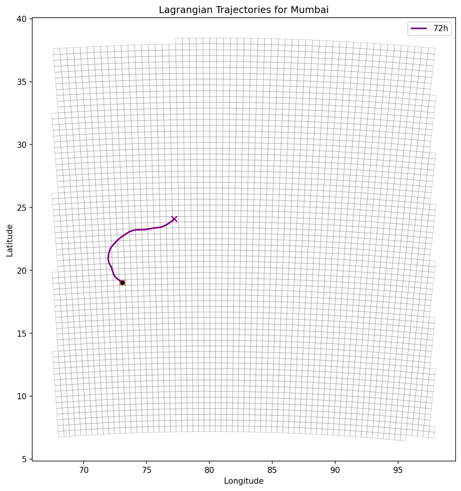
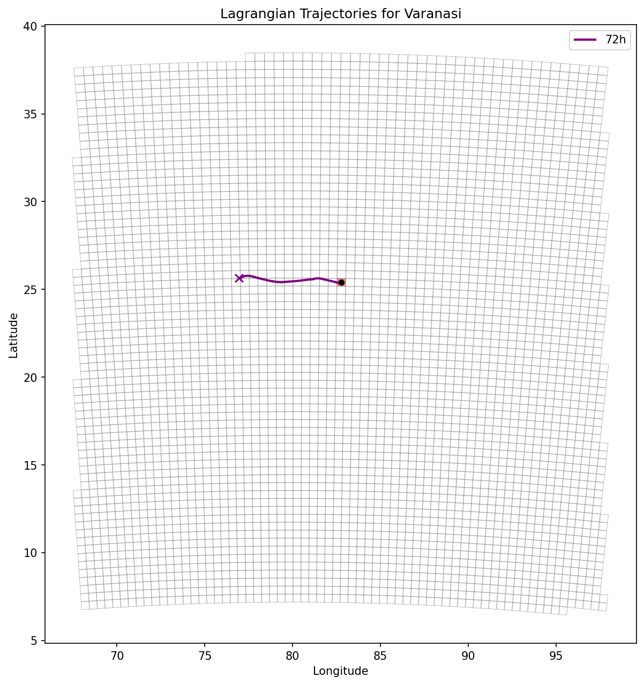

# Mode A: 2D Near-Surface Kinematic Trajectory Pilot
Date: 2020-11-01 12:00:00 UTC

This report executes the Python-native kinematic trajectory model using RK4 integration over ERA5 meteorological fields. **This is explicitly a 2D near-surface pilot.**

## Delhi

### 24-hour Trajectory
- **Max Distance from Target**: ~217.6 km
- **Source Grids Crossed**: 5
- **Domain**: 100.0% Indian residence, 0.0% Outside-domain
- **Top Sources:**
  - **IND_049_018**: 28.4% (Distance: 180.3 km)
  - **IND_048_019**: 27.9% (Distance: 111.8 km)
  - **IND_048_020**: 19.9% (Distance: 70.7 km)
  - **IND_047_021**: 15.6% (Distance: 0.0 km)
  - **IND_049_017**: 8.1% (Distance: 223.6 km)

### 48-hour Trajectory
- **Max Distance from Target**: ~456.2 km
- **Source Grids Crossed**: 9
- **Domain**: 100.0% Indian residence, 0.0% Outside-domain
- **Top Sources:**
  - **IND_049_018**: 14.4% (Distance: 180.3 km)
  - **IND_049_016**: 14.4% (Distance: 269.3 km)
  - **IND_048_019**: 14.1% (Distance: 111.8 km)
  - **IND_049_017**: 12.3% (Distance: 223.6 km)
  - **IND_050_014**: 10.4% (Distance: 380.8 km)

### 72-hour Trajectory
- **Max Distance from Target**: ~625.7 km
- **Source Grids Crossed**: 14
- **Domain**: 100.0% Indian residence, 0.0% Outside-domain
- **Top Sources:**
  - **IND_052_011**: 12.1% (Distance: 559.0 km)
  - **IND_051_012**: 10.9% (Distance: 492.4 km)
  - **IND_049_018**: 9.7% (Distance: 180.3 km)
  - **IND_049_016**: 9.7% (Distance: 269.3 km)
  - **IND_048_019**: 9.5% (Distance: 111.8 km)

## Mumbai

### 24-hour Trajectory
- **Max Distance from Target**: ~95.5 km
- **Source Grids Crossed**: 4
- **Domain**: 100.0% Indian residence, 0.0% Outside-domain
- **Top Sources:**
  - **IND_028_012**: 40.8% (Distance: 100.0 km)
  - **IND_027_011**: 35.7% (Distance: 70.7 km)
  - **IND_026_012**: 15.3% (Distance: 0.0 km)
  - **IND_028_013**: 8.2% (Distance: 111.8 km)

### 48-hour Trajectory
- **Max Distance from Target**: ~137.8 km
- **Source Grids Crossed**: 7
- **Domain**: 100.0% Indian residence, 0.0% Outside-domain
- **Top Sources:**
  - **IND_028_014**: 26.8% (Distance: 141.4 km)
  - **IND_028_012**: 20.6% (Distance: 100.0 km)
  - **IND_027_011**: 18.0% (Distance: 70.7 km)
  - **IND_028_013**: 14.4% (Distance: 111.8 km)
  - **IND_026_012**: 7.7% (Distance: 0.0 km)

### 72-hour Trajectory
- **Max Distance from Target**: ~165.1 km
- **Source Grids Crossed**: 8
- **Domain**: 100.0% Indian residence, 0.0% Outside-domain
- **Top Sources:**
  - **IND_029_015**: 19.7% (Distance: 212.1 km)
  - **IND_029_014**: 18.3% (Distance: 180.3 km)
  - **IND_028_014**: 17.7% (Distance: 141.4 km)
  - **IND_028_012**: 13.6% (Distance: 100.0 km)
  - **IND_027_011**: 11.9% (Distance: 70.7 km)

## Varanasi

### 24-hour Trajectory
- **Max Distance from Target**: ~201.8 km
- **Source Grids Crossed**: 5
- **Domain**: 100.0% Indian residence, 0.0% Outside-domain
- **Top Sources:**
  - **IND_040_029**: 28.0% (Distance: 150.0 km)
  - **IND_040_030**: 28.0% (Distance: 100.0 km)
  - **IND_040_031**: 20.0% (Distance: 50.0 km)
  - **IND_040_032**: 16.0% (Distance: 0.0 km)
  - **IND_040_028**: 8.0% (Distance: 200.0 km)

### 48-hour Trajectory
- **Max Distance from Target**: ~348.8 km
- **Source Grids Crossed**: 7
- **Domain**: 100.0% Indian residence, 0.0% Outside-domain
- **Top Sources:**
  - **IND_040_027**: 20.4% (Distance: 250.0 km)
  - **IND_040_028**: 18.4% (Distance: 200.0 km)
  - **IND_040_026**: 14.3% (Distance: 300.0 km)
  - **IND_040_029**: 14.3% (Distance: 150.0 km)
  - **IND_040_030**: 14.3% (Distance: 100.0 km)

### 72-hour Trajectory
- **Max Distance from Target**: ~540.2 km
- **Source Grids Crossed**: 11
- **Domain**: 100.0% Indian residence, 0.0% Outside-domain
- **Top Sources:**
  - **IND_040_027**: 13.7% (Distance: 250.0 km)
  - **IND_040_028**: 12.3% (Distance: 200.0 km)
  - **IND_040_026**: 11.0% (Distance: 300.0 km)
  - **IND_040_025**: 9.6% (Distance: 350.0 km)
  - **IND_040_024**: 9.6% (Distance: 400.0 km)

## Exact Data Requirements for Mode B (Regional 3D)
To implement a true 3D regional atmospheric transport model, the following ERA5 fields on pressure levels are required:
- u (u-component of wind) at 1000, 925, 850, 700 hPa
-  (v-component of wind) at 1000, 925, 850, 700 hPa
- omega (vertical velocity) at corresponding levels
Integration would use 4D linear/spline interpolation (lat, lon, pressure, time).